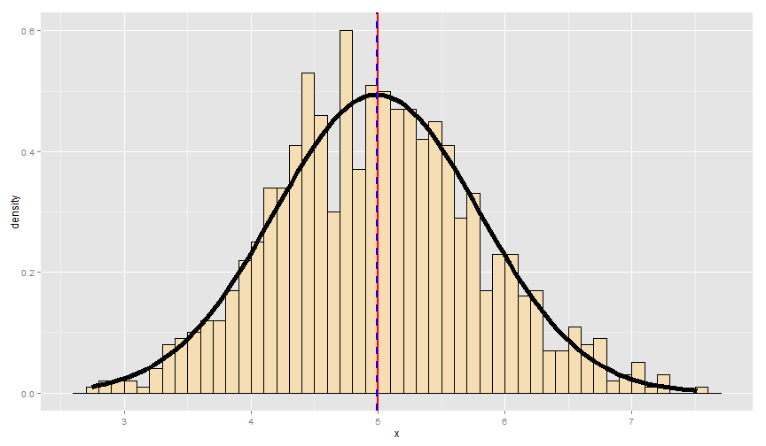
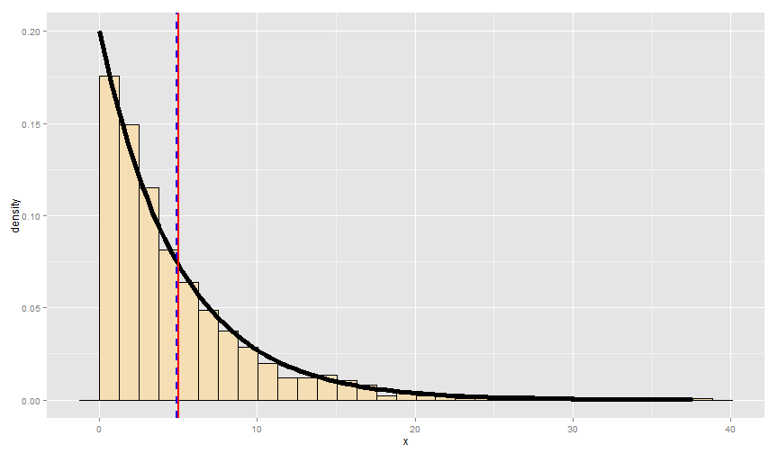

# Exponential distributions and the Central Limit Theorem

### Author: Fernando Flores

### Date: December 20th, 2015


## Synopsis

The current report aims to investigate the exponential distribution and the application of the Central Limit Theorem (CLT) to a simulation case. Description information from an exponential distribution, like the mean and variance, is gathered by applying the CLT and compared to its theoretical values. Also, the simulation try to explain how the CLT helps us to describe an exponential distribution by approaching to a normal one.


## The exponential distribution

The only parameter of an exponential distribution is $\lambda$ which has to be greater than 0. $\lambda$ is used to compute the mean and standard deviation by the following formulas:

$$\mbox{Mean} = \frac{1}{\lambda}$$

$$\mbox{Standard deviation} = \frac{1}{\lambda}$$


### References

1. [Wikipedia](https://en.wikipedia.org/wiki/Exponential_distribution)

2. [Wolfram MathWorld](http://mathworld.wolfram.com/ExponentialDistribution.html)


## Simulations

For simulation purposes, the value of $\lambda$ is setted to 0.2. The investigation targets the distribution of averages of 40 exponentials, simulated a thousand times.


```r
exp.n <- 1000
exp.avg.n <- 40
exp.lambda <- 0.2
exp.mean <- 1 / exp.lambda
exp.sd <- 1 / exp.lambda
exp.var <- (exp.sd ^ 2) / (exp.avg.n)
```

According to the Central Limit Theorem:

$$\frac{\bar X_n - \mu}{\sigma / \sqrt{n}}=
\frac{\sqrt n (\bar X_n - \mu)}{\sigma}
= \frac{\mbox{Estimate} - \mbox{Mean of estimate}}{\mbox{Std. Err. of estimate}}$$


To start the simulation and for the sake of reproducibility, a seed is setted with the value `9713`. Then, a matrix is created with the values generated of 40 exponentials on each row. After that, a data frame stores the means of each row, meaning the average of each group of 40 exponentials.


```r
set.seed(9713)

exp.simulation.matrix <- NULL

for (i in 1 : exp.n) {
    exp.simulation.matrix <- rbind(exp.simulation.matrix, 
                                   rexp(exp.avg.n, exp.lambda))
}

exp.simulation <- data.frame(x = rowMeans(exp.simulation.matrix))
```


## Features analysis

The plot shows the distribution of the simulation, which tends to be normal.


```r
exp.simulation.mean <- mean(exp.simulation$x)
exp.simulation.sd <- sd(exp.simulation$x)
exp.simulation.var <- var(exp.simulation$x)

library(ggplot2)
plotAverages <- ggplot(exp.simulation, aes(x = x)) + 
    geom_histogram(binwidth = 0.1, 
                   colour = "black",
                   fill = "wheat",
                   aes(y = ..density..)) 
plotAverages <- plotAverages + 
    stat_function(fun = dnorm, 
                  args = list(mean = exp.simulation.mean, 
                              sd = exp.simulation.sd), 
                  size = 2) +
    geom_vline(xintercept = exp.mean, 
               colour = "red",
               size = 1) +
    geom_vline(xintercept = exp.simulation.mean, 
               colour = "blue", 
               size = 1,
               linetype = "dashed")
plotAverages
```

 

*Figure 1. Distribution of 40 averages of exponentials simulated 1000 times. Red solid line shows the theoretical mean and blue dashed line shows the simulation mean.*


### Sample mean vs theoretical mean

As seen on *Figure 1*, the theoretical mean (red solid line) is very close to the simulation mean (blue dashed line), as expected.


```r
meansTable <- data.frame(Type = c("Theoretical mean", "Simulation mean"), 
                         Value = c(exp.mean, exp.simulation.mean))
kable(meansTable, format = "markdown")
```


|Type             |    Value|
|:----------------|--------:|
|Theoretical mean | 5.000000|
|Simulation mean  | 4.992519|

*Figure 2. Theoretical and simulation means from a distribution of 40 averages of exponentials simulated 1000 times*


### Sample variance vs theoretical variance

The variance of the sample mean is $\frac{\sigma ^ 2}{n}$

In order to compare the values:


```r
varianceTable <- data.frame(Type = c("Theoretical variance", 
                                     "Simulation variance"), 
                            Value = c(exp.var, exp.simulation.var))
kable(varianceTable, format = "markdown")
```


|Type                 |     Value|
|:--------------------|---------:|
|Theoretical variance | 0.6250000|
|Simulation variance  | 0.6524268|

*Figure 3. Theoretical and simulation variances from a distribution of 40 averages of exponentials simulated 1000 times*

By the information above, the simulation and theoretical variances are close for this simulation exercise, but not nearly equal like the case for the compared means. As the variance is a measure of how spread is a distribution, we can say the simulation and theoretical values tend to be closer as the number of simulations increases.


## Distribution

After analyzing the features of a simulation of 1000 means of 40 exponentials, we can compare it with a distribution of 1000 exponentials.


```r
set.seed(9713)

exp.simulation.2 <- data.frame(x = rexp(exp.n, exp.lambda))
exp.simulation.2.mean <- mean(exp.simulation.2$x)

plotExponential <- ggplot(exp.simulation.2, aes(x = x)) + 
    geom_histogram(#binwidth = 0.1, 
                   colour = "black",
                   fill = "wheat",
                   aes(y = ..density..)) 
plotExponential <- plotExponential + 
    stat_function(fun = dexp, 
                  args = list(rate = exp.lambda), 
                  size = 2) +
    geom_vline(xintercept = exp.mean, 
               colour = "red",
               size = 1) +
    geom_vline(xintercept = exp.simulation.2.mean, 
               colour = "blue", 
               size = 1,
               linetype = "dashed")
plotExponential
```

```
## stat_bin: binwidth defaulted to range/30. Use 'binwidth = x' to adjust this.
```

 

*Figure 4. Distribution of 1000 exponentials. Red solid line shows the theoretical mean and blue dashed line shows the simulation mean.*

It's clear that for this new simulation, the theoretical and sample mean are again close, as predicted by the first simulated run where the distribution approximates to a normal one.

This application of the CLT is very important to gather information of any distribution when having a large enough sample. For the current case, by expressing the data using averages of exponentials, we can inspect the information of the sample using the same tools and properties that are used with a normal distribution.
